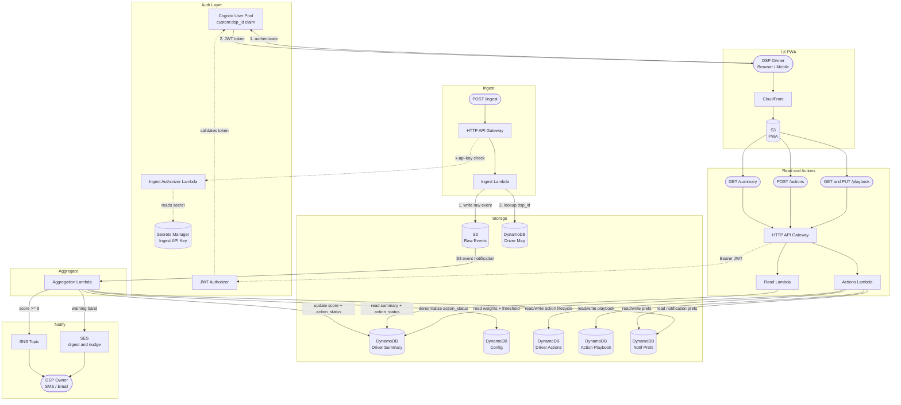

# Signal Aggregator — Architecture

## Overview

Signal Aggregator is an event-driven, serverless pipeline built on AWS. It ingests driver safety signals, aggregates them into a per-driver severity score over a rolling 7-day window, notifies DSP owners when a score crosses a threshold, and exposes a read API consumed by a Progressive Web App (PWA).

The V0 display model is an **action queue**, not a dashboard. Rather than showing scores, the UI surfaces the recommended action for each flagged driver and tracks whether the DSP owner has responded. The architecture reflects this: three DynamoDB tables (driver actions, action playbook, notification preferences) sit alongside the existing pipeline and are served by two new API endpoints (`POST /actions`, `GET|PUT /playbook`).

Auth was added in V1: all DSP-facing endpoints are protected by a Cognito JWT authorizer; the ingest endpoint is protected by a Secrets Manager–backed API key checked by a Lambda authorizer.

---

## System Diagram



> AG1 and AG2 are the same HTTP API (`4u3d4nahch`). Shown separately for layout clarity.

---

## Auth Architecture

Two separate auth paths protect different caller types:

### DSP-facing endpoints (`GET /summary`, `POST /actions`, `GET|PUT /playbook`)

1. The DSP owner authenticates against the Cognito User Pool and receives a signed JWT (ID token).
2. The PWA passes the token as `Authorization: Bearer <token>` on every API call.
3. API Gateway's JWT Authorizer validates the token signature against Cognito's JWKS endpoint. Invalid or missing tokens return `401` before Lambda is invoked.
4. Valid tokens pass `custom:dsp_id` (set at account creation, immutable) into `event.requestContext.authorizer.jwt.claims`. The Lambda reads DSP identity from this claim — callers cannot forge it.

### Ingest endpoint (`POST /ingest`)

The ingest API is called by internal services, not DSP owners. It uses a REQUEST (Lambda) authorizer:

1. Caller passes `x-api-key: <secret>` in the request header.
2. API Gateway invokes the Ingest Authorizer Lambda before routing to the Ingest Lambda.
3. The authorizer reads the expected secret from Secrets Manager (module-level cache — one read per warm instance) and returns `isAuthorized: true/false`.
4. Wrong or missing key returns `403 Forbidden`.

The secret is stored in Secrets Manager (`signal-aggregator/ingest-api-key`) and never in environment variables or source code.

---

## Flow Descriptions

### 1. Ingest
A caller POSTs a JSON event to the ingest API with a valid `x-api-key` header. The Ingest Lambda writes the raw event to S3 (partitioned by date/hour) and resolves `dsp_id` from `driver_id` via the Driver→DSP mapping table. The raw event includes `event_id` for idempotency. `dsp_id` is written into the raw event payload so the Aggregation Lambda can propagate it to the driver summary.

### 2. Aggregate
The S3 write triggers an S3 event notification that invokes the Aggregation Lambda. It reads signal weights and the notification threshold from the config table, recomputes the driver's rolling 7-day severity score (weighted sum: signal_type weight × severity multiplier), and writes the updated summary — including `dsp_id` — to the Driver Summary table.

### 3. Notify
If the recomputed score reaches **9 or above**, the Aggregation Lambda publishes to the SNS topic. SNS delivers a notification to the DSP owner via email or SMS.

### 4. Read
`GET /summary` requires a valid Cognito JWT. API Gateway extracts `custom:dsp_id` from the token and passes it to the Read Lambda. The Lambda filters the driver summary table to return only drivers belonging to that DSP, including their current `action_status`. A DSP can only see its own drivers.

### 5. Actions
`POST /actions` logs a DSP owner's response to a flagged driver (`in_progress`, `resolved`, or `snoozed`). The Actions Lambda writes the action record to the driver_actions table and denormalizes `action_status` onto the driver summary for fast queue rendering. `GET /playbook` and `PUT /playbook` read and update the DSP's configured action playbook — the per-signal-type recommended actions shown in the UI. `GET /playbook` merges stored entries over the default playbook so all 9 signal/severity combos are always returned.

### 6. Notify
Three-tier notification model:
- **Tier 1 (Interrupt):** Aggregation Lambda publishes to SNS when a driver score crosses the threshold for the first time. Suppressed if `notified_at` is set and score has not dropped below threshold since.
- **Tier 2 (Nudge):** Aggregation Lambda publishes to SES when a driver enters the warning band (score ≥ 6, configurable). Batched into next morning's send — never sent per-driver in real time.
- **Tier 3 (Digest):** Scheduled weekly email via SES. Covers all drivers above threshold, in warning band, and resolved that week.

### 7. UI (PWA)
A Progressive Web App served from S3 via CloudFront. Mobile-first. Renders an action queue — drivers sorted by status (Needs Action → Watching → Resolved) — not a score dashboard. Each item shows the recommended action from the DSP's playbook and a control to log action, snooze, or dispute. Auth flow: DSP owner authenticates against Cognito on first load; tokens are refreshed silently.

---

## Data Stores

| Store | Type | Contents |
|---|---|---|
| Raw Events | S3 | One JSON file per event: `events/YYYY/MM/DD/HH/{event_id}.json` |
| Driver → DSP Map | DynamoDB | PK: `driver_id` → `dsp_id` |
| Driver Summary | DynamoDB | PK: `driver_id` → severity score, event counts by type, `dsp_id`, `action_status`, `notified_at`, last updated |
| Config | DynamoDB | Global threshold (9), signal weights, severity multipliers. Key hierarchy: `global → region → dsp` |
| Driver Actions | DynamoDB | PK: `action_id`, SK: `driver_id` → action lifecycle (needs_action / in_progress / snoozed / resolved), notes, timestamps. GSI on `dsp_id + status` for queue queries. |
| Action Playbook | DynamoDB | PK: `dsp_id`, SK: `signal_key` (`{signal_type}#{severity}`) → DSP-configured recommended action text. Defaults applied for missing entries at read time. |
| Notification Prefs | DynamoDB | PK: `dsp_id` → per-tier enable flags, digest schedule, quiet hours, timezone, contact info |
| Ingest API Key | Secrets Manager | Single secret string. Read by the Ingest Authorizer Lambda on first invocation per warm instance. |

---

## Severity Score Formula

```
score = Σ ( signal_type_weight × severity_multiplier )
        for all events in the last 7 days

signal_type_weight:   hard_braking=1, on_road_observation=2, customer_complaint=3
severity_multiplier:  low=1, medium=2, high=3
notification fires when score ≥ 9
```

**Example:** One high-severity customer complaint = 3 × 3 = **9** → notification fires immediately.

---

## API Surface

| Route | Auth | Lambda | Notes |
|---|---|---|---|
| `POST /ingest` | x-api-key (Secrets Manager) | signal-aggregator-ingest | Internal callers only |
| `GET /summary` | Cognito JWT | signal-aggregator-read | Scoped to caller's dsp_id |
| `POST /actions` | Cognito JWT | signal-aggregator-actions | Logs action, denormalizes status |
| `GET /playbook` | Cognito JWT | signal-aggregator-actions | Returns all 9 entries, merging custom over defaults |
| `PUT /playbook` | Cognito JWT | signal-aggregator-actions | Updates one or more playbook entries |

---

## Out of Scope (V0) — Still Deferred

- Multi-user roles within a DSP
- Per-DSP threshold configuration (config hierarchy is in place)
- Score decay within the 7-day window
- Historical trend queries
- Multiple ingest sources
- Dispute / score correction workflow (designed, not built)
- Non-English language support (locale file structure in place; `en-US` only)
- Native mobile app (PWA only)

---

## V1 — Completed

- **Auth:** Amazon Cognito User Pool with `custom:dsp_id` claim; JWT Authorizer on all DSP-facing routes. DSP data is now fully isolated — a DSP can only read its own drivers.
- **Ingest protection:** Lambda REQUEST authorizer with Secrets Manager–backed API key.
- **Actions Lambda:** `POST /actions` logs action lifecycle; `GET|PUT /playbook` manages per-DSP playbook config.
- **DynamoDB tables:** driver-actions, playbook, notification-prefs — all live.
- **action_status denormalization:** Actions Lambda writes `action_status` back to driver summary; Read Lambda surfaces it in the queue response.
- **dsp_id on driver summary:** Ingest → Aggregate pipeline now propagates `dsp_id` through to the summary record.

## V2 Candidates

- Amazon Managed Grafana for real-time fleet-level view (complements action queue, doesn't replace it)
- Configurable rolling window duration (currently hardcoded at 7 days)
- QuickSight for historical trend analysis once S3 data accumulates
- SAML/SSO for enterprise DSP access
- WhatsApp / regional channel support (notification dispatch abstraction already in place)
- Score decay weighting (recent events weighted more heavily within the window)
- WW region expansion (config hierarchy and locale structure already in place)
- Multi-user roles within a DSP (owner vs. ops manager)

---

## Known Gaps at Scale

These are not blockers for V1 (a learning project at low volume), but would need to be addressed before production.

### 1. Race condition on driver summary writes — Critical
The Aggregation Lambda does a read-modify-write on the driver summary. At concurrent volume, multiple Lambda invocations for the same `driver_id` run simultaneously — last write wins and intermediate updates are lost, producing incorrect scores.

**Fix:** Replace read-modify-write with DynamoDB atomic `ADD` operations on score and event count attributes.

### 2. SNS notification storm — High
No deduplication on notifications. Once a driver's score crosses 9 and stays there, every subsequent event re-triggers an SNS publish.

**Fix:** Add a `notified_at` timestamp to the driver summary. Suppress re-notification unless the score has dropped below threshold and crossed it again.

### 3. Silent event loss under load — High
S3 event notifications invoke Lambda asynchronously with 3 retries. If Lambda hits its concurrency limit or DynamoDB throttles, retries exhaust and the event is silently dropped.

**Fix:** Insert an SQS queue between S3 events and the Aggregation Lambda.

### 4. Config table read on every invocation — Low
Weights and threshold are read from DynamoDB on every Aggregation Lambda invocation.

**Fix:** Cache config in Lambda memory with a short TTL (e.g., 60 seconds).

### 5. GET /playbook merges in-memory — Low
The playbook merge (stored entries + defaults) happens in Lambda memory. At 9 entries this is trivial; at scale with many signal types it should move to a DynamoDB write-through cache or a fully materialized playbook record per DSP.

### 6. Cold start amplification under burst traffic — Low
Burst traffic causes Lambda to scale out rapidly. Simultaneous cold starts add 200–500ms of processing delay per new instance.

**Fix:** Provisioned concurrency on the Aggregation Lambda.
