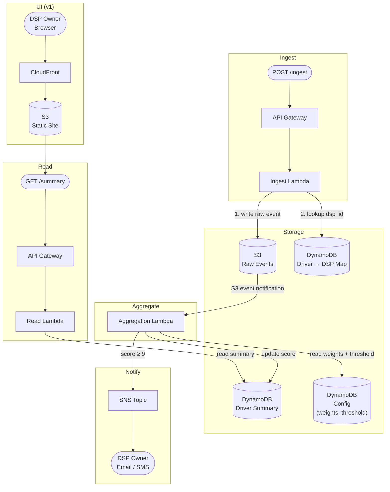

# Signal Aggregator — Architecture

## Overview

Signal Aggregator is an event-driven, serverless pipeline built on AWS. It ingests driver safety signals, aggregates them into a per-driver severity score over a rolling 7-day window, notifies DSP owners when a score crosses a threshold, and exposes a read API consumed by a lightweight static UI.

---

## System Diagram



---

## Flow Descriptions

### 1. Ingest
A caller POSTs a JSON event to the ingest API. The Ingest Lambda writes the raw event to S3 (partitioned by date/hour) and resolves `dsp_id` from `driver_id` via the Driver→DSP mapping table. The raw event includes `event_id` for idempotency.

### 2. Aggregate
The S3 write triggers an S3 event notification that invokes the Aggregation Lambda. It reads signal weights and the notification threshold from the config table, recomputes the driver's rolling 7-day severity score (weighted sum: signal_type weight × severity multiplier), and writes the updated summary to the Driver Summary table.

### 3. Notify
If the recomputed score reaches **9 or above**, the Aggregation Lambda publishes to the SNS topic. SNS delivers a notification to the DSP owner via email or SMS.

### 4. Read
A GET request to the read API invokes the Read Lambda, which fetches the current driver summary from DynamoDB and returns it as JSON. The static UI calls this endpoint on page load.

### 5. UI (v1)
A minimal static HTML/JS site hosted on S3, served via CloudFront. Calls the read API and renders a table of drivers sorted by severity score. No auth in v1.

---

## Data Stores

| Store | Type | Contents |
|---|---|---|
| Raw Events | S3 | One JSON file per event: `events/YYYY/MM/DD/HH/{event_id}.json` |
| Driver → DSP Map | DynamoDB | PK: `driver_id` → `dsp_id` |
| Driver Summary | DynamoDB | PK: `driver_id` → severity score, event counts by type, last updated |
| Config | DynamoDB | Global threshold (9), signal weights, severity multipliers |

---

## Severity Score Formula

```
score = Σ ( signal_type_weight × severity_multiplier )
        for all events in the last 7 days

signal_type_weight:   hard_braking=1, on_road_observation=2, customer_complaint=3
severity_multiplier:  low=1, medium=2, high=3
notification fires when score ≥ 9
```

**Example:** One high-severity customer complaint = 3 × 3 = **9** → notification fires immediately.

---

## Out of Scope (v1)

- Auth on any API endpoint
- Per-DSP threshold configuration (single global threshold)
- Score decay within the 7-day window
- Historical trend queries
- Multiple ingest sources
- Dispute / score correction workflow (designed, not built)

---

## v2 Candidates

- Amazon Managed Grafana for real-time dashboard (replaces static site)
- Per-region threshold overrides in config table
- Configurable rolling window duration
- QuickSight for historical trend analysis
- SAML/SSO for external DSP user access

---

## Known Gaps at Scale

These are not blockers for v1 (a learning project at low volume), but would need to be addressed before production.

### 1. Race condition on driver summary writes — Critical
The Aggregation Lambda does a read-modify-write on the driver summary. At concurrent volume, multiple Lambda invocations for the same `driver_id` run simultaneously — last write wins and intermediate updates are lost, producing incorrect scores.

**Fix:** Replace read-modify-write with DynamoDB atomic `ADD` operations on score and event count attributes. No read needed; DynamoDB handles the increment atomically.

### 2. SNS notification storm — High
No deduplication on notifications. Once a driver's score crosses 9 and stays there, every subsequent event re-triggers an SNS publish. DSP owners receive repeated alerts for the same driver, turning signal into noise.

**Fix:** Add a `notified_at` timestamp to the driver summary. Suppress re-notification unless the score has dropped below threshold and crossed it again, or a configurable cooldown window has elapsed.

### 3. Silent event loss under load — High
S3 event notifications invoke Lambda asynchronously with 3 retries on failure. If Lambda hits its concurrency limit or DynamoDB throttles, retries exhaust and the event is silently dropped — a safety signal is permanently missed with no record.

**Fix:** Insert an SQS queue between S3 events and the Aggregation Lambda. SQS holds events until capacity is available; nothing is dropped, and the queue depth becomes a visible metric for backpressure.

### 4. Config table read on every invocation — Low
Weights and threshold are read from DynamoDB on every Aggregation Lambda invocation. The config rarely changes; this is unnecessary latency and cost at scale.

**Fix:** Cache config in Lambda memory with a short TTL (e.g., 60 seconds). One read warms the cache; subsequent invocations on the same instance use the cached value.

### 5. Cold start amplification under burst traffic — Low
Burst traffic causes Lambda to scale out rapidly. Simultaneous cold starts add 200–500ms of processing delay per new instance, creating a latency spike at the worst possible moment.

**Fix:** Provisioned concurrency on the Aggregation Lambda eliminates cold starts at the cost of a fixed hourly charge. Acceptable in production; unnecessary for v1.
